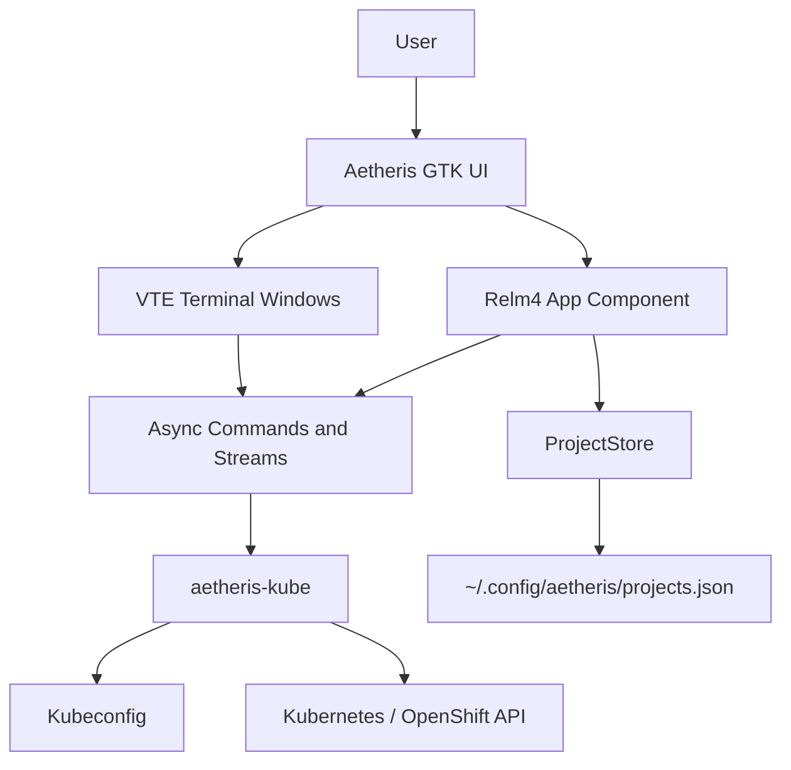
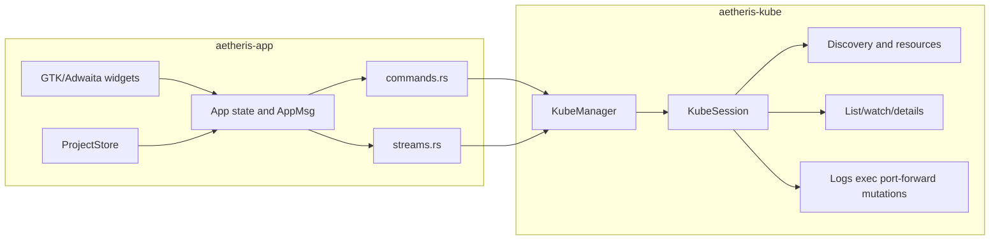
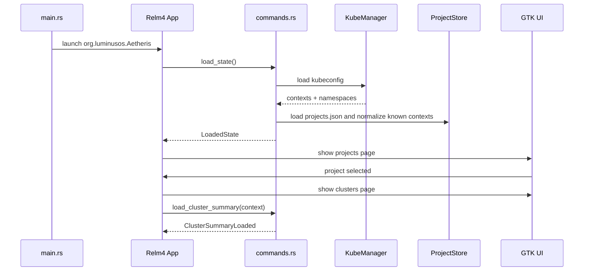
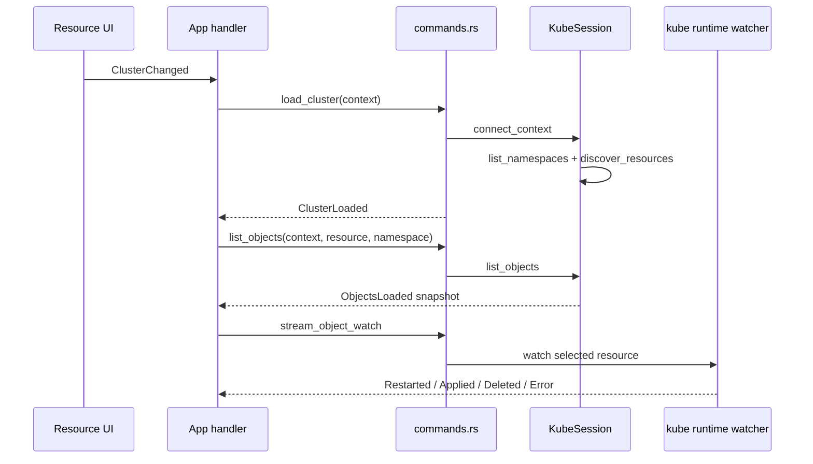
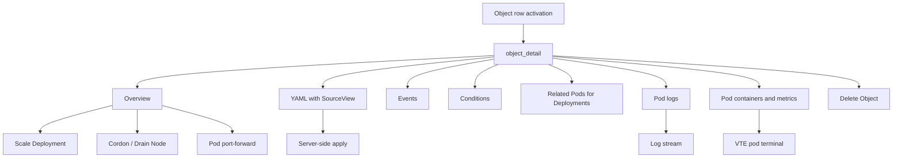
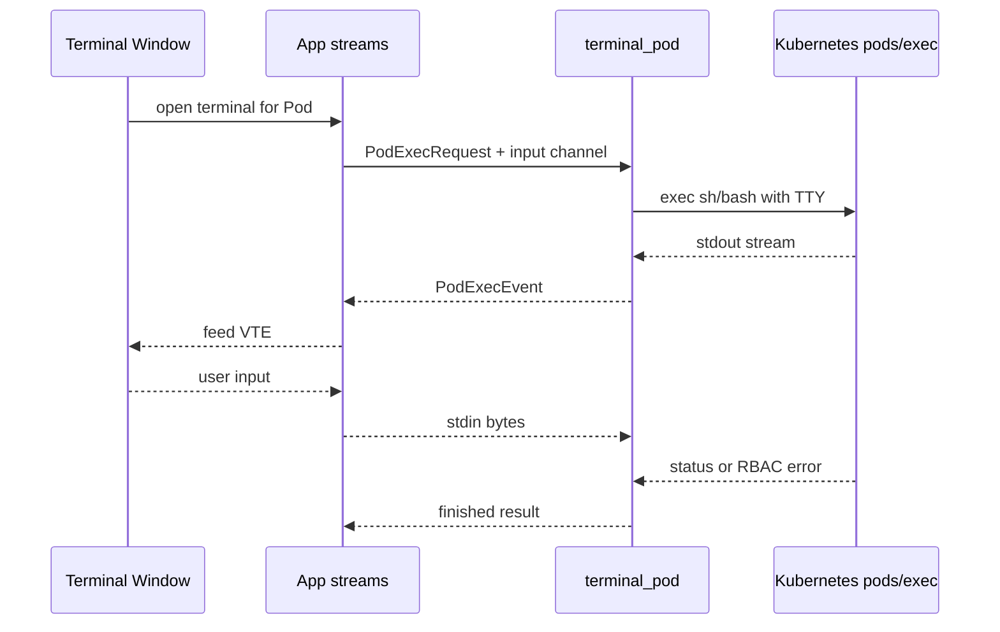
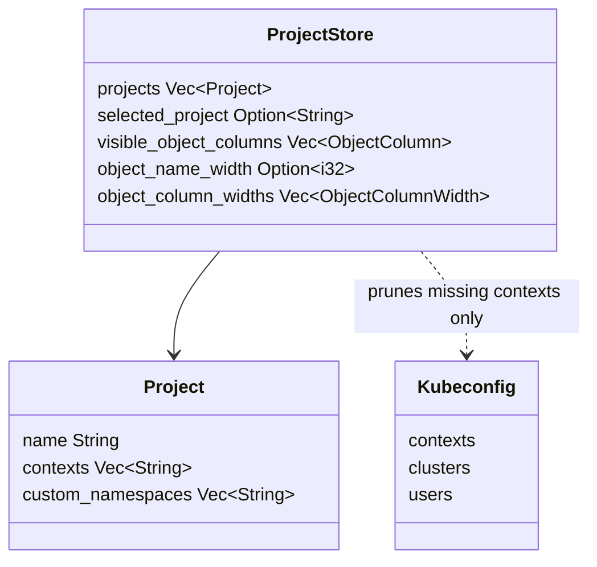
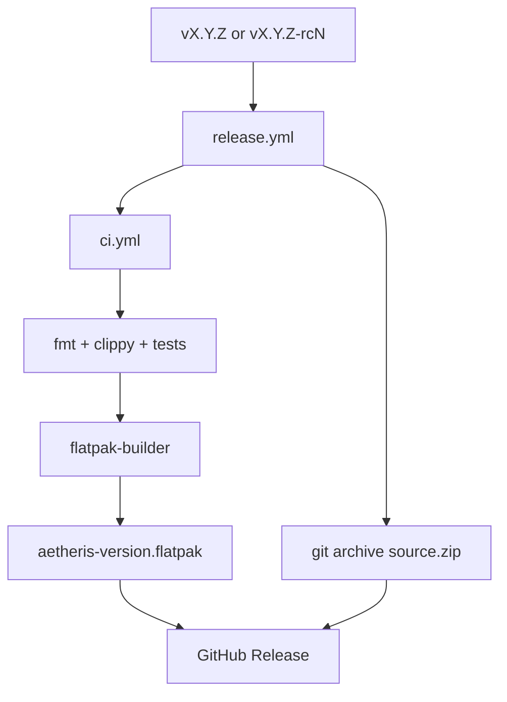

# Aetheris Architecture

Aetheris is a native GNOME Kubernetes client. It is split into a pure Kubernetes backend crate and a Relm4/GTK4/Libadwaita application crate.

## Overview

`aetheris-app` owns windows, widgets, user state, and persistence of Aetheris projects. `aetheris-kube` owns kubeconfig parsing, Kubernetes clients, discovery, list/watch, mutations, logs, exec, port-forwarding, metrics, and resource details.

## Crate Boundaries

The backend crate must not import GTK, Adwaita, Relm4, VTE, or application widgets. Shared data crosses the boundary through DTOs exported from `aetheris-kube::types`.

## Application Lifecycle

The app starts on the Projects page. Selecting a project shows only clusters explicitly assigned to that project. Contexts created externally by `kubectl` or `oc` do not automatically appear in projects.

## Cluster And Resource Flow

The list view uses a snapshot for fast initial rendering, then a watcher keeps visible objects current. Rows are built in chunks to avoid blocking the GTK main loop on very large resource lists.

## Details And Operations

Operations run through `aetheris-kube` and return updated details or explicit errors. Long-running operations use abort handles so switching clusters, closing windows, or changing detail views can stop background work cleanly.

## Terminal Flow

The default terminal container is selected from the Pod name when possible. If Kubernetes denies `pods/exec`, the terminal window displays a permission error instead of staying blank.

## Project Store

`ProjectStore` lives in `~/.config/aetheris/projects.json`. It controls which clusters appear in each project, custom namespaces, visible columns, and table widths. Kubeconfig contexts are not automatically imported into projects.

## Packaging And Release

The Flatpak manifest is `build-aux/org.luminusos.Aetheris.json`. Releases are created from tags and publish a Flatpak bundle plus source zip.

## Design Constraints

- The UI follows GNOME HIG and Libadwaita patterns.
- The resource browser must stay usable on narrow windows and avoid forcing the window wider.
- Errors should be actionable, especially Kubernetes RBAC denials.
- Secrets such as bearer tokens are never re-rendered when editing a cluster.
- Backend modules should remain small and focused; do not grow `lib.rs` beyond module declarations and public exports.
