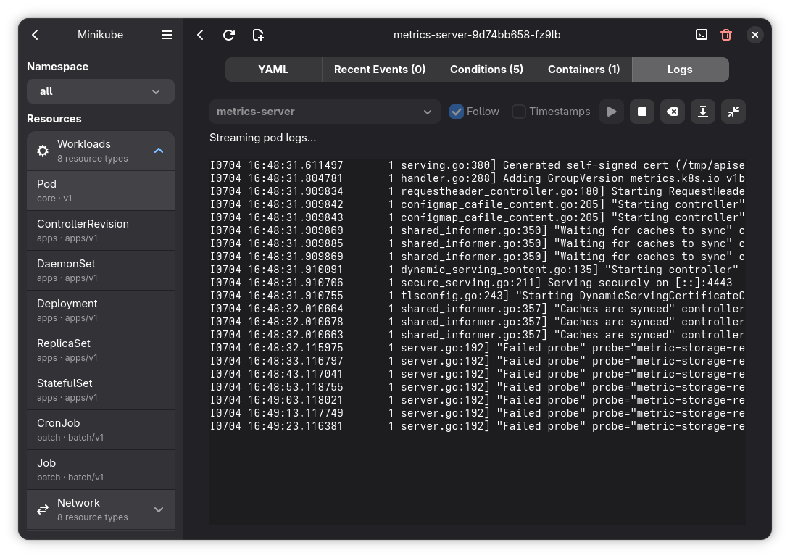

# Aetheris

**Your clusters, above the clouds.**

A native GNOME Kubernetes client, built in Rust with GTK4 and Libadwaita.

[Website](https://luminusos.org/aetheris) · [LuminusOS](https://luminusos.org) · [Report a bug](https://github.com/luminusOS/aetheris/issues)

---

Aetheris takes its name from *Aether* — in classical mythology, the highest,
purest and brightest layer of the sky. That is the idea behind the app: a
place where your clusters run clean, clear and untouchable.

It connects through kubeconfig, organizes clusters by project, and provides a
desktop UI for browsing resources, inspecting YAML, streaming pod logs, opening
interactive pod terminals, and running common operations such as apply, delete,
scale, cordon, drain, and port forwarding.

## Features

- **Projects & clusters** — organize any number of clusters into projects and switch instantly.
- **Resource browser** — workloads, networking, storage and config across all namespaces, with live status.
- **YAML editor** — inspect and edit any object with syntax highlighting, then apply it back.
- **Live logs** — real-time pod log streaming with follow mode and ANSI colors.
- **Pod terminals** — a real interactive terminal inside any container, powered by VTE.
- **Operations** — scale, delete, cordon, drain and port-forward without leaving the app.
- **Kubeconfig-first** — reads `~/.kube/config`, and can import and create entries.

## Screenshots

| Resource browser |
| :---: |
|  |

| Cluster overview | Pod terminal |
| :---: | :---: |
|  |  |

| YAML editor | Live logs |
| :---: | :---: |
|  |  |

## Documentation

- [CONTRIBUTING.md](CONTRIBUTING.md) — development setup, local run commands,
  verification, Flatpak builds, release tags, and contribution guidelines.
- [ARCHITECTURE.md](ARCHITECTURE.md) — crate boundaries, application flow,
  Kubernetes operations, project persistence, and release pipeline diagrams.

## Built with

[Rust](https://www.rust-lang.org/) · [GTK4](https://gtk.org/) ·
[Libadwaita](https://gitlab.gnome.org/GNOME/libadwaita) ·
[Relm4](https://relm4.org/) · [kube-rs](https://kube.rs/) ·
[GtkSourceView](https://gitlab.gnome.org/GNOME/gtksourceview) · [VTE](https://gitlab.gnome.org/GNOME/vte)
